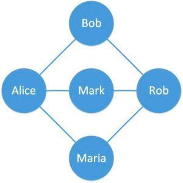
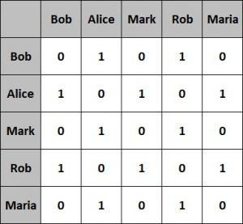
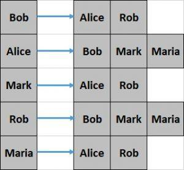

# Graphs

A graph is a data structure for storing connected data such as a network of people on a social media platform.

A graph consists of vertices and edges. A vertex represents the entity (e.g., people) and an edge represents the relationship between entities (e.g., a person’s friendships).

------------------------------------------------
## Graph Representations

A graph can be represented in different forms such as adjacency matrix and adjacency list. Each one has their pros and cons in a different setup.

We’ll introduce these graph representations in this section.

### Adjacency Matrix

An adjacency matrix is a square matrix with dimensions equivalent to the number of vertices in the graph.

The elements of the matrix typically have values 0 or 1. A value of 1 indicates adjacency between the vertices in the row and column and a value of 0 otherwise.

Let’s see what the adjacency matrix looks like for our simple graph from the previous section:

This representation is fairly easier to implement and efficient to query as well. However, it’s less efficient with respect to space occupied.

### Adjacency List

An adjacency list is nothing but an array of lists. The size of the array is equivalent to the number of vertices in the graph.

The list at a specific index of the array represents the adjacent vertices of the vertex represented by that array index.

This representation is comparatively difficult to create and less efficient to query. However, it offers better space efficiency.

We’ll use the adjacency list to represent the graph in this tutorial.

